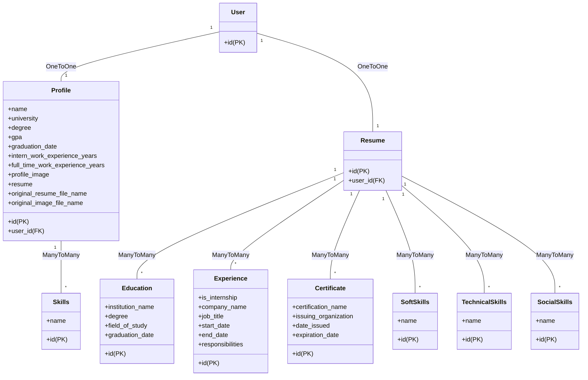

# README.md

## 1. Overview

This project is a comprehensive job search and resume matching application, targeting Intern, and Graduate jobs
that leverages the power of modern technologies for both the front-end (FE) and back-end (BE)
development.

On the front-end, we use JavaScript and Vue.js, a progressive JavaScript framework for building user interfaces. Vue.js
allows us to create a dynamic, responsive, and user-friendly interface.
I selected the use of PrimeVue (https://primevue.org/) as a component library for Vue.js.

On the back-end, we use Python + Django, a powerful and versatile web framework used by top commercial companies such
as Instagram, Dropbox, Spotify, Pinterest and more.

The application uses SerpAPI (https://serper.dev/) for Google Searches on Google Jobs. SerpAPI is a real-time
API to access Google search results.
It allows us to programmatically search for jobs and retrieve the results in a structured format.

To normalize both the resumes and the job descriptions, we use OpenAI's function calls which
are used to extract a pre-defined set of parameters from the job descriptions and resumes.
This normalization process allows us to match job seekers with the most suitable jobs effectively.

## 2. How to Install

### Back-End Installation (Python)

1. Clone the repository to your local machine.
2. Navigate to the project directory.
3. Install the required Python packages using pip:
   ```
   pip install -r requirements.txt
   ```
4. Run the application:
   ```
   python manage.py runserver
   ```

### Front-End Installation (JavaScript and Vue)

1. Navigate to the front-end directory within the project.
2. Install the required npm packages:
   ```
   npm install
   ```
3. Start the Vue application:
   ```
   npm run serve
   ```

### Update your secrets

create a file called .env in the root of the project and add the following variables:
(since those accounts are paid, you need to have your own account and add the keys to the .env file)

```
SEP_API_KEY="your serp api key"
OPENAI_API_KEY="your openai api key"
```

## 3. Testing

The application has been thoroughly tested both manually and using automated tests. Manual testing was conducted to
ensure the user interface is intuitive and responsive.

On the back-end, we have implemented Django unittests. These tests ensure the integrity of our application by testing
the individual units of source code.

To run the tests, use the following command:

```
python manage.py test
```

## 4. Database Design

The database design is represented in the class diagram below. The diagram shows the database tables, their primary
keys, foreign keys, and the relationships between them.





## 5. Job Enrichment

```
python manage.py test api.unit_test.test_job_enricher.TestJobEnricher.test_job_enricher
```

## 6. Deployment

The project was customized to be deployed on Heroku.
Configuration files .env.production and .env.development allow different FE configurations for both environments

Limitations of the deployment:

- it is using SQLite as a database, which is not recommended for production. since the file system is ephemeral in
  Heroku, the database will be lost after a restart.

useful commands:

watch the execution logs from the deployed application:

```
heroku logs --tail --app grad-path
```

configure an environment variable (usually to setup secrets):

```
heroku config:set SEP_API_KEY="your serp api key" --app grad-path
```

execute shell commands on the deployed application:

```
heroku run ls -F --app grad-path
```

test Heroku locally

```
heroku local web
```
